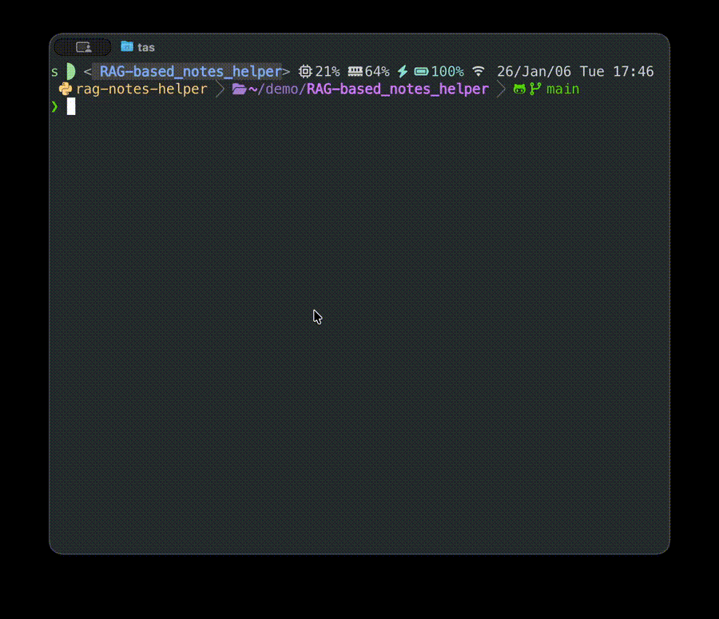

# RAG-based Notes Helper


A **Retrieval-Augmented Generation (RAG)** assistant for querying and reviewing your own notes using **local embeddings** (Hugging Face), **Vector search** (Faiss), and **LLM backends** (Hugging Face / Gemini / OpenAI / Ollama).

This project emphasizes **correct RAG design**, **memory-safe ingestion**, **testable**, and **real-world workflows** (Docker + CI).

[](./LICENSE)

<p align="center">
    <a href="docs/demo.mp4">
        
    </a>
</p>

[**Quick Start**](#running-via-docker)


---

## Overview

 - [Why](#why)
 - [Features](#features)
 - [Architecture](#architecture)
 - [Project Structure](#project-structure)
 - [How It Works](#how-it-works)
 - [Installation & Setup](#installation-setup)
 - [Usage](#usage)
 - [Testing](#testing)
 - [Limitations](#limitations)
 - [Future Work](#future-work)
 - [License](#license)

---

## Why

This project shows how to build an **LLM system without fine-tuning**

### Why not fine-tuning

Fine-tuning is often **costly** and **unnecessary** for note-based knowledge system

- Requires retraining when knowledge updates
- Higher infrastructure and maintenance cost
- Introduces model drift and reproducibility issue
- Hard to debug hallucinations

### Why RAG

- **Knowledge stays external and inspectable**
    - Your notes remain the only source of truth

- **Instant updates**
    - New documents are indexed without retraining

- **Lower cost**
    - Only relevant chunks are sent to the LLM rather than entire file

- **Reducing hallucinations**
    - LLM only generates content strictly based on high-quality retrieval

---

## Features

- Retrieval-Augmented Generation (**RAG**) over notes
- **Memory-safe & streaming ingestion** for large note files
- Overlapping chunking with configurable window size
- Sentence-Transformer embeddings
- Dense vector retrieval using **Faiss**
- **LLM** backends:
    - Hugging Face
    - Ollama
    - Gemini
    - OpenAI
- Source-aware answers with citation
- Interactive CLI with explicit startup phase and live re-indexing
- **Latency logging** for RAG components
- **Smart and force index rebuild modes** for efficient updates
- Runtime configuration validation with clear error reporting
- Import-safe architecture with runtime-only validation (CI-friendly)
- Unit-tested components
- **Dockerized** for reproducible execution
- **CI/CD-enabled** (GitHub Actions)
    - Automatic test on push and pull requests
    - Docker build validation

---

## Architecture

```text
Notes → Chunking → Embedding → Index
                                  ↓
Query   →   Embedding   →   Retrieval   →   LLM   →   Answer
```

---

## Project Structure

```text
RAG-based_notes_helper/
├── README.md
├── pyproject.toml
├── uv.lock
├── .env.example                    # template for creating .env
├── Dockerfile
├── docker-compose.yml              # runtime-only, pull-only
├── LICENSE
├── pytest.ini
├── .gitignore
├── .dockerignore
│
├── src/
│   └── rag_notes_helper/
│       ├── cli.py                  # entry point (rag-app)
│       │
│       ├── core/
│       │   └── config.py
│       │
│       ├── utils/
│       │   ├── logger.py
│       │   └── timer.py
│       │
│       └── rag/
│           ├── ingest.py
│           ├── loaders.py
│           ├── index.py
│           ├── meta_store.py
│           ├── chunking.py
│           ├── retrieval.py
│           ├── answer.py
│           │
│           └── llm/
│               ├── hf_api.py
│               ├── ollama_api.py
│               ├── openai_api.py
│               └── gemini_api.py
│
├── tests/                          # unit tests
│   ├── test_ingest.py
│   ├── test_loaders.py
│   ├── test_index.py
│   ├── test_chunking.py
│   ├── test_retrieval.py
│   └── test_answer.py
│
├── data/                           # place your notes here!!!
│   └── notes_helper.md             # base knowledge
│
├── storage/                        # rag metadata and faiss
│   ├── faiss.index
│   ├── meta.jsonl
│   └── meta.idx
│
├── hf_cache/                       # huggingface cache
│
├── docs/                           # display media file
│
├── logs/                           # monitoring latency
│
└── .github/                        # github action
    └── workflows/
        ├── ci.yml
        └── cd.yml
```

## How It Works

0. **Startup & Validation**
    - CLI arguments are parsed
    - Configuration is validated at runtime
    - Index is loaded or rebuilt if requested

1. **Ingestion**
    - Files in `data/` are scanned
    - Binary files are skipped via null-byte detection
    - Text is processed **line-by-line** to avoid memory exhaustion

2. **Chunking**
    - Streaming chunk generator splits text into overlapping windows
    - Prevents memory exhaustion
    - Configurable chunk and overlap size

3. **Indexing**
    - Each chunk is embedded using SentenceTransformer
    - Embeddings are normalized and indexed with faiss

4. **Retrieval**
    - User query is embedded with the same embedding model
    - faiss retrieves top-k relevant chunks
    - Low-scoring matches are filtered out

5. **Generation**
    - Retrieved chunks are written into an LLM prompt
    - LLM is instructed to answer **only from retrieved context**
    - Citations are shown with the answer

---

## Installation & Setup

Make sure the following requirements have been setup before running the app

### Prerequisites

- **python** >= 3.10
- `pip` or **uv** (recommended)
- **Docker** >= 20.10
- **git** (optional)

### 1. Configuration (`.env`)

Create `.env` at project root based on `.env.example`:

```bash
curl -L -o .env.example \
https://raw.githubusercontent.com/StevenHuang41/RAG-based_notes_helper/main/.env.example
```

```bash
cp .env.example .env
```

Uncomment the provider you wanna use, make sure the following variables exist in `.env`:
```text
LLM_PROVIDER=xxx
LLM_MODEL=yyy
LLM_API_KEY=sk_xxxxxx
```

You can also customize other configuration values in `.env`

See [Hugging Face Token](https://huggingface.co/docs/hub/security-tokens) to create an API key.

### 2. Notes directory (`data/`)

Create a `data/` and place your notes inside it:
```bash
mkdir data
```

Example structure:
```text
RAG-based_notes_helper/
└── data/
    ├── notes_helper.md
    └── [your notes]
```

To download the `notes_helper.md`:
```bash
cd data
curl -L -o notes_helper.md \
https://raw.githubusercontent.com/StevenHuang41/RAG-based_notes_helper/main/data/notes_helper.md
```

You must have **at least one text file** in `data/` to avoid no chunk to index error.

---

## Usage

### Running from Source:

```bash
git clone https://github.com/StevenHuang41/RAG-based_notes_helper.git
cd RAG-based_notes_helper
# get into venv
uv pip install -e .
```

[Setup `.env`](#1-configuration-env)

[Setup `data/`](#2-notes-directory-data)

#### One time query
```bash
rag-app what is xxx
rag-app "what is ..."
rag-app [command]
rag-app --help                              # show help message
rag-app "what is xxx" --update              # smart reindex before answering
rag-app "what is xxx" --reindex             # reindex before answering
rag-app "what is xxx" --config              # check configuration
rag-app "what is xxx" --citaions            # including citations in answer
rag-app "what is xxx" --sources             # show indexed source files
rag-app "I wanna know ..." > answer.txt     # save generated answer
```

#### Interactive REPL (recommended)
Runs rag-app repeatedly in REPL mode (faster after initial load):

```bash
rag-app --repl                  # run REPL mode
rag-app "what is xxx" --repl    # answer query in REPL mode
```

### Running via Docker

No need to clone git repo

Setup:
```bash
mkdir rag_application
cd rag_application

# get docker-compose.yml
curl -L -o docker-compose.yml \
https://raw.githubusercontent.com/StevenHuang41/Rag-based_notes_helper/main/docker-compose.yml

# get docker image
docker pull ghcr.io/stevenhuang41/rag-based-notes-helper:latest
```

[Setup `.env`](#1-configuration-env)
    - !! remember to use docker url for `OLLAMA_BASE_URL` in .env

[Setup `data/`](#2-notes-directory-data)

Runs at project root:
```bash
docker compose run --rm rag-app "query"
```

Do **NOT** use `docker compose up` for interactive CLI

(optional)
```bash
docker run --rm -it \
  --env-file .env \
  -v ./data:/app/data \                                 # mount data/
  -v ./storage:/app/storage \                           # mount storage/
  -v ./hf_cache:/root/.cache/huggingface \              # mount cache file
  -e TZ=Asia/Taipei \                                   # set timezone for log file
  -v ./logs:/app/logs \                                 # mount log file
  ghcr.io/stevenhuang41/rag-based-notes-helper:latest \
  "query" [commands]
```

### Commands:

* `--help` or `-h`
    - Show help message

* `--repl`
    - Run in REPL mode

* `--reindex` or `-r`
    - Process all files in data/ to rebuild rag index

* `--update` or `-u`
    - Only process files that changed its content, faster than `--reindex` if only few changes

* `--citations` or `-ci`
    - Toggle citations display

* `--sources` or `-so`
    - Show indexed source files

* `--config` or `-co`
    - Show configuration

#### REPL mode

- `:quit`       /   `:q`      (exit)
- `:help`       /   `:h`      (show instructions)
- `:reindex`    /   `:ri`     (reindex all files without exiting)
- `:update`     /   `:u`      (update only changed files)
- `:citations`  /   `:ci`     (toggle citations display)
- `:sources`    /   `:so`     (show indexed files)
- `:config`     /   `:co`     (check configuration)
- `:stream`     /   `:s`      (toggle stream mode)

 ---

## Testing

Runs unit tests at project root:

```bash
pytest
```

---

## Limitations

- No conversation memory (single-turn only)
- PDF ingestion not implemented
- Designed for personal note collections

---

## Future Work

- Conversational memory
- PDF loaders

## License

[MIT License](./LICENSE)

