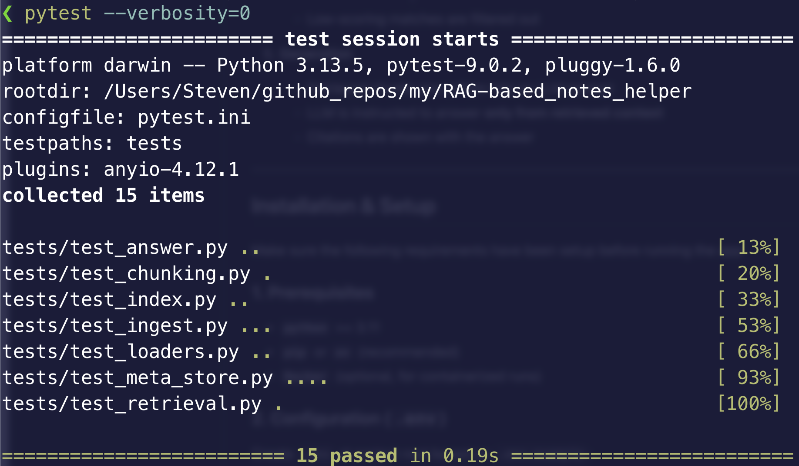

# RAG-based Notes Helper


A local-first Retrieval-Augmented Generation (RAG) application for querying personal notes and documents. The system indexes notes with SentenceTransformer embeddings and FAISS, retrieves relevant chunks for each query, and sends grounded context to a configurable LLM backend.

The application can run from source or as a containerized CLI. It supports one-time queries, an interactive REPL, source citations, smart re-indexing, multiple LLM providers, PDF ingestion, and RAGAS-based evaluation.

<p align="center">
    <a href="docs/demo.mp4">
        
    </a>
</p>

---

## Contents

- [Why RAG for Notes](#why-rag-for-notes)
- [Features](#features)
- [Architecture](#architecture)
- [How It Works](#how-it-works)
- [Evaluation](#evaluation)
- [Tech Stack](#tech-stack)
- [Project Structure](#project-structure)
- [Local Development](#local-development)
- [Usage](#usage)
- [Docker Usage](#docker-usage)
- [Configuration](#configuration)
- [Testing](#testing)
- [CI/CD](#cicd)
- [Limitations](#limitations)
- [Future Work](#future-work)
- [License](#license)

---

## Why RAG for Notes

A note assistant should answer from the current knowledge base without requiring model fine-tuning every time the notes change.

Fine-tuning is usually a poor fit for personal notes because:

- knowledge updates require additional training runs;
- model behavior becomes harder to debug and reproduce;
- private notes may be mixed into model weights;
- hallucination sources are harder to inspect;
- infrastructure cost increases for a problem that can be solved with retrieval.

This project keeps knowledge external and inspectable. Notes are chunked, embedded, indexed, retrieved at query time, and passed to the LLM as explicit context.

---

## Features

### Retrieval pipeline

- Ingests `.txt`, `.md`, `.pdf`, and `.py` files from `data/`.
- Splits documents into overlapping chunks with configurable chunk size and overlap.
- Generates local embeddings with SentenceTransformer.
- Stores vectors in FAISS for similarity search.
- Stores chunk metadata separately in JSONL with an offset index for efficient lookup.
- Supports smart indexing so unchanged files do not need to be reprocessed.

### Generation

- Supports multiple LLM backends:
  - Hugging Face Inference API
  - Google Gemini
  - OpenAI
  - Ollama for local inference
- Grounds answers in retrieved context.
- Supports optional citation output for source visibility.
- Supports streaming responses in REPL mode.

### CLI workflow

- One-time query mode for shell usage and scripting.
- Interactive REPL mode for repeated queries after the index is loaded.
- Commands for re-indexing, smart updates, configuration inspection, source listing, citation toggling, stream toggling, and evaluation.

### Engineering workflow

- Runtime configuration validation with Pydantic Settings.
- Docker image published through GitHub Container Registry.
- GitHub Actions workflows for tests and container builds.
- Unit tests for ingestion, loading, chunking, indexing, retrieval, metadata storage, and answer generation.
- Latency and runtime logs under `logs/`.

---

## Architecture

```text
Documents in data/
        |
        v
Loaders (.txt / .md / .pdf / .py)
        |
        v
Streaming chunking
        |
        v
SentenceTransformer embeddings
        |
        +--------------------+
        |                    |
        v                    v
FAISS vector index      Metadata store
        |                    |
        +---------+----------+
                  |
                  v
User query -> query embedding -> top-k retrieval
                  |
                  v
Prompt with retrieved context
                  |
                  v
LLM backend -> grounded answer + optional citations
```

---

## How It Works

1. **Configuration validation**
   - The CLI reads `.env` through Pydantic Settings.
   - Required provider/model/key fields are validated before runtime.

2. **Document loading**
   - Files in `data/` are scanned for supported extensions.
   - Loaders normalize source content into text streams.

3. **Chunking**
   - Documents are split into overlapping chunks.
   - Chunk size and overlap are controlled by `CHUNK_SIZE` and `CHUNK_OVERLAP`.

4. **Indexing**
   - Chunks are embedded with `sentence-transformers/all-MiniLM-L6-v2` by default.
   - Embeddings are normalized and stored in a FAISS index.
   - Chunk text and source metadata are stored outside the vector index.

5. **Retrieval**
   - The user query is embedded with the same embedding model.
   - FAISS retrieves the top-k nearest chunks.
   - Low-scoring matches are filtered with `MIN_RETRIEVAL_SCORE`.

6. **Answer generation**
   - Retrieved chunks are inserted into the LLM prompt as context.
   - The answer can include source citations.
   - REPL mode keeps the loaded index available for faster repeated queries.

---

## Evaluation

The CLI includes a RAGAS evaluation mode:

```bash
rag-app --eval
```

Evaluation reports are generated locally under `src/rag_notes_helper/eval/reports/` and are ignored by git by default because they are runtime artifacts.

A recent local evaluation run used:

| Setting / Metric | Value |
|---|---:|
| `TOP_K` | 5 |
| `LLM_TEMPERATURE` | 0.1 |
| `MIN_RETRIEVAL_SCORE` | 0.3 |
| `CHUNK_SIZE` | 800 |
| `CHUNK_OVERLAP` | 200 |
| Faithfulness | 1.000 |
| Answer relevancy | 0.750 |
| Context precision | 0.797 |
| Context recall | 1.000 |
| Evaluation provider | Gemini |

These metrics are produced by the evaluation pipeline under `src/rag_notes_helper/eval/` and provide a repeatable way to compare retrieval and generation settings.

---

## Tech Stack

| Layer | Tools |
|---|---|
| CLI / runtime | Python, argparse, Pydantic Settings |
| Retrieval | FAISS, SentenceTransformer, NumPy |
| LLM backends | Hugging Face, Gemini, OpenAI, Ollama |
| Evaluation | RAGAS, LangChain integrations |
| Document parsing | PyMuPDF for PDF support, text/markdown/python loaders |
| Packaging | uv, hatchling, pyproject.toml |
| Testing | pytest |
| Containerization | Docker, Docker Compose, GitHub Container Registry |
| CI/CD | GitHub Actions |

---

## Project Structure

```text
RAG-based_notes_helper/
├── README.md
├── pyproject.toml
├── uv.lock
├── .env.example
├── Dockerfile
├── docker-compose.yml
├── LICENSE
├── .github/workflows/
│   ├── ci.yml
│   └── cd.yml
├── data/
│   └── notes_helper.md             # example/base note file tracked by git
├── docs/
│   ├── demo.gif
│   ├── demo.mp4
│   └── test.png
├── src/rag_notes_helper/
│   ├── cli.py                      # rag-app entry point
│   ├── core/config.py              # runtime settings and validation
│   ├── eval/                       # RAGAS evaluation workflow
│   ├── rag/
│   │   ├── answer.py
│   │   ├── chunking.py
│   │   ├── index.py
│   │   ├── ingest.py
│   │   ├── loaders.py
│   │   ├── meta_store.py
│   │   ├── retrieval.py
│   │   └── llm/                    # provider implementations
│   └── utils/
└── tests/                          # pytest unit tests
```

Runtime directories such as `storage/`, `logs/`, and `hf_cache/` are created locally and ignored by git.

---

## Local Development

### Prerequisites

- Python 3.11+
- `uv` recommended
- Docker optional for containerized usage
- API key for the selected remote LLM provider, unless using Ollama locally

### Install from source

```bash
git clone https://github.com/StevenHuang41/RAG-based_notes_helper.git
cd RAG-based_notes_helper
uv sync
```

Create a local environment file:

```bash
cp .env.example .env
```

Edit `.env` and choose one LLM provider.

The repository includes `data/notes_helper.md` as an example document. Add your own notes under `data/`.

---

## Usage

### One-time query

```bash
uv run rag-app "What does my note say about RAG?"
```

Useful options:

```bash
uv run rag-app "What is RAG?" --update      # smart re-index before answering
uv run rag-app "What is RAG?" --reindex     # rebuild the full index before answering
uv run rag-app "What is RAG?" --citations   # include source citations
uv run rag-app --sources                     # list indexed source files
uv run rag-app --config                      # show validated configuration
uv run rag-app --eval                        # run RAGAS evaluation
```

### Interactive REPL

```bash
uv run rag-app --repl
```

REPL commands:

```text
:quit      or :q     exit
:help      or :h     show commands
:reindex   or :ri    rebuild the index from scratch
:update    or :ud    smart update changed files
:citations or :ci    toggle citation display
:sources   or :so    show indexed files
:config    or :co    show configuration
:stream    or :s     toggle stream mode
:evaluate  or :ev    run evaluation
```

---

## Docker Usage

Create a working directory with `.env`, `data/`, and `docker-compose.yml`:

```bash
mkdir rag-application
cd rag-application

curl -L -o docker-compose.yml \
  https://raw.githubusercontent.com/StevenHuang41/RAG-based_notes_helper/main/docker-compose.yml

curl -L -o .env.example \
  https://raw.githubusercontent.com/StevenHuang41/RAG-based_notes_helper/main/.env.example

cp .env.example .env
mkdir -p data storage logs hf_cache
```

Add notes under `data/`, then run:

```bash
docker compose run --rm rag-app "What do my notes say about RAG?"
```

For Ollama from Docker, set:

```text
LLM_PROVIDER=ollama
LLM_MODEL=llama3.1
OLLAMA_BASE_URL=http://host.docker.internal:11434
```

Do not use `docker compose up` for the interactive CLI workflow; use `docker compose run --rm rag-app ...` instead.

Equivalent `docker run` example:

```bash
docker run --rm -it \
  --env-file .env \
  -v "$(pwd)/data:/app/data" \
  -v "$(pwd)/storage:/app/storage" \
  -v "$(pwd)/hf_cache:/root/.cache/huggingface" \
  -v "$(pwd)/logs:/app/logs" \
  -e TZ=Asia/Taipei \
  ghcr.io/stevenhuang41/rag-based-notes-helper:latest \
  "What do my notes say about RAG?"
```

---

## Configuration

The application reads configuration from `.env`.

Minimal remote-provider configuration:

```text
LLM_PROVIDER=gemini
LLM_MODEL=gemini-2.0-flash
LLM_API_KEY=your-api-key
```

Minimal Ollama configuration:

```text
LLM_PROVIDER=ollama
LLM_MODEL=llama3.1
LLM_API_KEY=not-used
OLLAMA_BASE_URL=http://localhost:11434
```

Common settings:

| Variable | Purpose | Default / example |
|---|---|---|
| `LLM_PROVIDER` | LLM backend | `hf`, `gemini`, `openai`, `ollama` |
| `LLM_MODEL` | Model name for selected provider | `gemini-2.0-flash` |
| `LLM_API_KEY` | API key for remote providers | required except Ollama |
| `LLM_MAX_CHUNKS` | Maximum retrieved chunks sent to LLM | `5` |
| `LLM_MAX_TOKENS` | Generation token budget | `1024` |
| `LLM_TEMPERATURE` | Generation temperature | `0.1` |
| `CHUNK_SIZE` | Chunk size for ingestion | `800` |
| `CHUNK_OVERLAP` | Chunk overlap | `200` |
| `TOP_K` | Number of retrieved chunks | `5` |
| `MIN_RETRIEVAL_SCORE` | Retrieval score threshold | `0.3` |
| `STREAM` | Stream model output where supported | `true` |

---

## Testing

Run unit tests from the project root:

```bash
uv run pytest
```

Test evidence:



---

## CI/CD

| Workflow | Purpose |
|---|---|
| `.github/workflows/ci.yml` | Install dependencies and run pytest |
| `.github/workflows/cd.yml` | Build and push the Docker image to GitHub Container Registry |

The published image name is:

```text
ghcr.io/stevenhuang41/rag-based-notes-helper:latest
```

---

## Limitations

- Single-turn query flow; conversation memory is not yet implemented.
- Retrieval quality depends on note quality, chunk size, and embedding model choice.
- Runtime artifacts such as FAISS indexes, logs, and evaluation reports are local by default.
- API-based LLM providers require valid credentials in `.env`.

---

## Future Work

- Make the RAG workflow more agentic, allowing the assistant to plan multi-step note exploration, decide when to retrieve again, and synthesize answers across multiple retrieval passes.
- Add conversation memory so follow-up questions can reuse prior context while still grounding final answers in retrieved notes.
- Add an optional web UI for browsing sources, retrieved chunks, answers, and citations.
- Improve deployment examples for local Ollama and remote LLM providers.

---

## License

This project is licensed under the [MIT License](./LICENSE).
